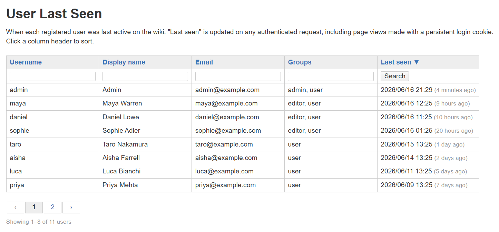

# User Last Seen plugin for DokuWiki

Records when each registered user was last active on the wiki, and shows it in an Admin-panel page. Useful for spotting dormant or stale accounts.

## What it does

- Every authenticated request updates that user's "last seen" timestamp. This is **last activity**, not just last login — a page view made with a persistent ("remember me") cookie counts, because the tracker hooks `DOKUWIKI_STARTED`, which fires after authentication resolves regardless of how the user authenticated.
- An Admin page (**User Last Seen**) lists every registered user with up to five columns: **Username · Display name · Email · Groups · Last seen**. The Email and Groups columns can each be hidden from the configuration. It appears in the "Additional plugins" section of the Admin panel (below the version info), not in the built-in "Administration" block where the User Manager lives — DokuWiki hard-codes which plugins get top-block placement, and third-party plugins always go into the lower section.
- "Last seen" shows both an absolute timestamp and a relative time ("3 days ago"). Users never seen since the plugin was installed show "never".
- Column headers are clickable to sort — sort by "Last seen" ascending to float dormant accounts to the top.
- A per-column **text filter** row (Username, Display name, Email, Groups) narrows the table. Matching is a plain case-insensitive substring — type `ad` to find `admin`. It is a server-side GET form, no JavaScript, modelled on the built-in User Manager's search row.
- The table is **paginated** with numbered page links (`‹ 1 … 4 5 6 … 20 ›`); the page size is configurable, and sorting/filtering survive paging because everything travels in the URL.

## Why an Admin page and not a column in the User Manager

The bundled User Manager fires no events for table rendering — its table is built with hardcoded `echo` statements and a fixed five-column layout. Adding a column would require forking the bundled `usermanager` plugin, which DokuWiki *core* upgrades overwrite (unlike third-party plugins). A separate Admin page uses only public APIs (`retrieveUsers()`, the admin-plugin interface), survives upgrades untouched, and can do things a cramped column can't — sortable, relative times, "never" highlighting. DokuWiki's admin UI hard-codes six built-in plugins (`usermanager`, `acl`, `extension`, `config`, `logviewer`, `styling`) in the top "Administration" block; all third-party admin plugins appear in a separate "Additional plugins" section below.

## Architecture

| Component | Role |
| --- | --- |
| `action.php` | Hooks `DOKUWIKI_STARTED`. If `REMOTE_USER` is set, records the user as seen (throttled). |
| `helper.php` | Owns the storage file and format. `record()` is internally throttled; `getAll()` / `getTimestamp()` for reads. |
| `admin.php` | The **User Last Seen** Admin page. Enumerates users via the auth backend, renders the sortable table. |

**Storage.** A single serialized `username → unix-timestamp` map at `{metadir}/_lastseen.dat`. The meta directory is used (not cache) so the data survives cache clears and DokuWiki upgrades. Writes are atomic (`io_saveFile()`) under a lock (`io_lock()`).

**Throttling.** Recording on every page view would be wasteful. `record()` only rewrites a user's timestamp if the stored one is older than `update_interval` (default 600s / 10 min). Heavy browsing produces at most one write per interval per user. "Last seen" is therefore accurate to within the interval, which is plenty for spotting dormant accounts.

## Configuration

Admin → Configuration Settings:

| Setting | Default | Effect |
| --- | --- | --- |
| `update_interval` | `600` | Throttle: minimum seconds between last-seen writes per user. Lower = more precise, more disk I/O. Minimum 60. |
| `show_never` | `1` (on) | List users never seen since install. Turn off to show only users with recorded activity. |
| `show_mail` | `1` (on) | Show the Email column. |
| `show_grps` | `1` (on) | Show the Groups column. |
| `entries_per_page` | `20` | Rows per page in the table. Set to `0` to show all users on one page (no pagination). |

## Access

The Admin page is **admin-only** (`forAdminOnly()` returns true) — last-seen data is mildly sensitive. To also allow managers (users in `$conf['manager']`), change `forAdminOnly()` in `admin.php` to return `false`.

## Requirements and caveats

- **Auth backend.** Built and tested against `authplain` (the default file-based backend). The Admin page enumerates users via `retrieveUsers()`. If the active backend can't list users (some LDAP/AD configurations), the page detects this via `$auth->canDo('getUsers')` and shows a notice instead of an incomplete roster.
- **Historical data.** Tracking begins at install — users are "never" until their first authenticated request afterward.
- **Deleted users.** If a user is removed from the wiki, their entry lingers in the storage file as harmless orphan data; the Admin page won't display it (it only shows users returned by `retrieveUsers()`). The file can be deleted to reset all data — it's rebuilt automatically.
- **Privacy.** This is mild activity tracking. Admin-only visibility is the intended boundary; for a staff wiki this is a normal administrative function.

## Install

Drop the folder into `lib/plugins/lastseen/`, or use Admin → Extension Manager → Manual Install to upload the zip. No "update suppression" date trick is needed — this is a local plugin with no upstream in the dokuwiki.org repository, so the Extension Manager never offers an update for it.

## Tested against

DokuWiki `2025-05-14b "Librarian"` under `error_reporting=E_ALL`.

## License

GPL 2.
